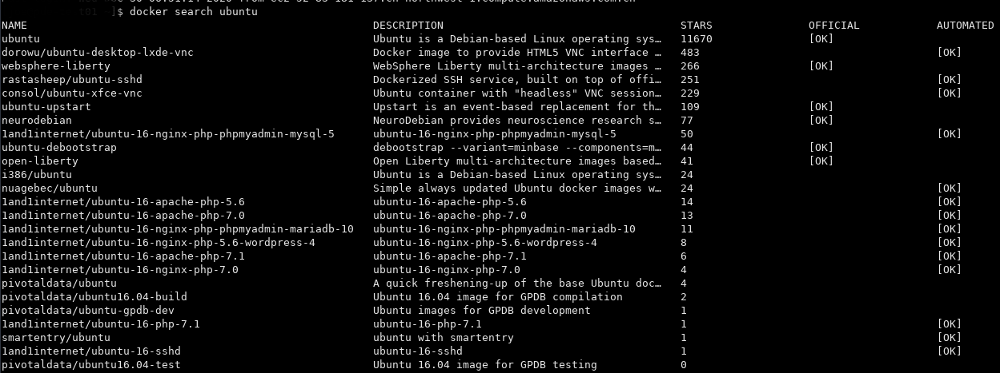

本文会总结一些docker的基础用法。
## Docker 基础调用

#### **docker search** (根据关键词搜索镜像文件) 
>docker search ubuntu 　　　　　　　　#查看包含“ubuntu”的image的名称

 
#### **docker pull**(下载镜像到本地) 
>docker pull ubuntu　　　　　　　　#下载ubuntu:latest至本地(默认会下载最新版本的镜像,也可以自由选择下载镜像的版本，如ubuntu:15.10)。


#### **docker images**(查看本地jenkins所有镜像)
>docker images　　　　　　　　#列出本地所有镜像及其信息(标签，镜像ID，创建时间，镜像大小)


#### **docker rmi**(删除镜像)
>docker rmi ubuntu　　　　　　　　#删除本地ubuntu镜像


#### **docker run**(运行并启动一个新的容器)
>docker run -it ubuntu　　　　　　　　#运行并启动一个ubuntu(如检测到本地无所需镜像，将先下载后再创建启动容器)
    >部分常用参数如下
    >- -i: 以交互模式运行容器，通常与-t同时使用；
    >- -t: 为容器重新分配一个伪输入终端，通常与-i同时使用；
    >- -p: 指定端口映射，格式为主机端口:容器端口
    >- -d: 后台运行容器，并返回容器ID；
    >- -P: 随机端口映射，容器内部端口随机映射到主机端口；
    >- --name='docker_test':为容器指定一个名称；
    >- --volume,-v:绑定一个卷
    
#### **docker stop**(停止一个容器的运行)
>docker stop Container_ID　　　　　　　　#停止相关容器运行
#### **docker rm**(删除一个或多个容器)
>docker rm Container_ID　　　　　　　　#删除相关容器
#### **docker ps**(显示所有容器进程)

#### **docker logs**(查看容器日志)
    >docker logs [OPTIONS] CONTAINER_ID
        Options:
            --details       显示更多信息
         -f,--follow        跟踪实时日志
            --since string  显示自某个timestamp之后的日志
            --tail string   从日志末尾显示多少行日志，默认是all
         -t,--timestamps    显示时间戳
            --until string  显示自某个timestamp之前的日志
***

#### **docker network**(查看docker网络信息)
>docker network ls
    docker提供给我们4种网络模式。当我们完成docker engine的安装以后，docker会在每个engine上生成三种网络，bridge，none和host。
- 无网络模式--none
    所有加入这个网络模式的container，都不能进行网络通信。
- 宿主网络模式--host
    这种网络模式将container与宿主机的网络相通。
- 自定义网络
    自定义网络主要包括三种，bridge，overlay，MACVLAN。对于bridge，我们可以自定义，然后就可以实现在一台host上的多个container间的通信，网络模式如下：

    - Overlay
    我们可以使用“原生态”的swarm来实现“服务发现”和“DNS解析”。


## Dockerfile
Dockerfile是一个用来构建镜像的文本文件,文本内容包含了一条条构建镜像所需的指令和说明。如果想要使用该镜像的话，还需要使用 *docker run* 命令来运行这个镜像从而生成容器。

#### 使用Dockerfile定制镜像
FROM：定制的镜像都是基于FROM的镜像作为base镜像，后续的操作也都是基于这个base镜像
RUN：用于执行后面的命令行命令。
- 注意：Dockerfile的每次指令每执行一次都会在docker上新建一层。所以在构建镜像时应尽量减少过多无意义的层。

#### 开始构建镜像
我们构建了一个Dockerfile文件，并在文件中添加如下内容：
```
    FROM nginx
    RUN echo '这是一个本地构建的nginx镜像'
```
在Dockerfile文件的存放目录下，使用build执行构建动作。通过下述语句构建了一个nginx:v3的镜像，其中最后的.代表本次执行的上下文路径(docker在构建镜像时，有时想要使用到本机的文件，docker build命令得知路径后，会将路径下的所有内容打包)
```
    $ docker build -t nginx:v3 .
```

根据上文内容，我们可以看出已经成功构建了一个新的镜像。


#### 常用指令详解
##### COPY
>复制指令，从上下文目录中复制文件或目录到容器里指定路径。
```
    COPY <源路径> <目标路径>
    COPY nginx.conf /etc/nginx/nginx.conf
```

##### CMD
>类似于RUN指令，用于运行程序。为启动的容器指定默认要运行的程序，程序运行结束，容器也就结束。如果Dockerfile中存在多个CMD指令，仅最后一个生效
- CMD在docker run时运行
- RUN是在docker build时运行
格式：
```
    CMD <shell 命令>
    CMD ["<可执行文件或命令>","<param1>","<param2>",...]
    CMD ["<param1>","<param2>",...]　　　# 该写法是为 ENTRYPOINT 指令指定的程序提供默认参数
```

##### ENTRYPOINT
>类似于CMD指令，但其不会被docker run的命令行参数指定的指令所覆盖
格式：
```
    ENTRYPOINT ["<executeable>","<param1>","<param2>",...]
```
假设已通过 Dockerfile 构建了 nginx:test 镜像：
```
FROM nginx

ENTRYPOINT ["nginx", "-c"] # 定参
CMD ["/etc/nginx/nginx.conf"] # 变参 
```
1、不传参运行
```
    $docker run  nginx:test
```
容器内会默认运行以下命令，启动主进程。
```
    nginx -c /etc/nginx/nginx.conf
```
2、传参运行
```
    $ docker run  nginx:test -c /etc/nginx/new.conf
```
容器内会默认运行以下命令，启动主进程(/etc/nginx/new.conf:假设容器内已有此文件)
```
    nginx -c /etc/nginx/new.conf
```

##### ENV 
>设置环境变量
格式：
```
    ENV <key> <value>
    ENV <key1>=<value1> <key2>=<value2>...
    ENV PATH='/app/pwp/am-pwa/bin:${PATH}'
```

##### VOLUME
>定义匿名数据卷，斌面重要的数据因容器重启而丢失
格式：
```
VOLUME ["<路径1>", "<路径2>"...]
VOLUME <路径>
```

##### EXPOSE
>声明端口，帮助镜像使用者明确镜像服务的守护端口，以方便配置映射。如果在启动容器时使用的docker run -P，EXPOSE的端口将被随机映射。
格式：
```EXPOSE <端口1> [<端口2>...]```

***
## Docker Compose
>Compose是用于定义和运行多容器Docker应用程序的工具。通过Compose，可以使用YML文件来配置和整合所有容器需要的服务，然后使用一条命令控制YML文件配置即可创建并启动所有需要的服务。
Compose使用的步骤如下：
>* 使用Dokcerfile定义容器所需的环境
>* 使用docker-compose.yml文件定义构成容器所需的服务，保证所有服务在隔离环境中可以一起运行
>* 执行docker-compose up命令启动并运行整个程序

### YML文件配置指令参考

#### version
指定本yml依从的compose哪个版本所制定

#### build
指定为构建镜像上下文路径：
例如，指定为从上下文路径./build/client/Dockerfile构建镜像：
```
version: "3.4"
services:
  vue-client:
  build: ./build/client
```

#### command
覆盖容器启动的默认命令。

#### container_name
指定自定义容器名称，若无自定义名称，则系统将自动生成默认名称。

#### environment
添加环境变量。可以使用数组、字典、任何布尔值。
```
environment:
      MONGODB_URL: "mongodb://mongo1:27017"
      MONGODB_DB_NAME: "${MONGODB_DB_NAME}"
      LM_LICENSE_FILE: "${MEDA_LM_LICENSE_FILE}"
```

#### healthcheck
用于检测docker服务是否健康运行。
```
healthcheck:
  test: ["CMD", "curl", "-f", "http://localhost"] # 设置检测程序
  interval: 1m30s # 设置检测间隔
  timeout: 10s # 设置检测超时时间
  retries: 3 # 设置重试次数
  start_period: 40s # 启动后，多少秒开始启动检测程序
```

#### image
指定容器运行的镜像。

#### restart
* no: 默认的重启策略，任何情况下不会重启容器。
* always: 容器总是重新启动。
* on-failure: 在容器非正常退出时会重启容器。
* unless-syopped: 在容器退出时重启容器，但不考虑在docker进程启动时就停止了的容器。

```
restart: "no"
restart: always
restart: on-failure
restart: unless-stopped
```

#### volumnes
volumns负责将主机的数据卷或文件挂载到容器里。具体来说，volumns由两种设置方式。

* 绝对路径
```
ghost:  

  image: ghost

  volumes:

    - ./ghost/config.js:/var/lib/ghost/config.js
```

* 卷标
```
services:
 mysql:  
  image: mysql
  container_name: mysql
  volumes:
    - mysql:/var/lib/mysql

volumes:
 mysql:
```
第一种方式路径直接挂载到本地，更加直观，但需要管理本地的路径。第二种方式使用卷标的方式，相对简介，但不知道数据存储在本地具体什么位置，需要使用类似 *docker volume ls* 的方式查看。