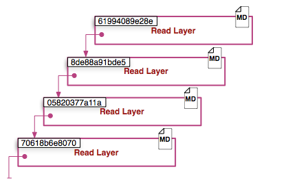
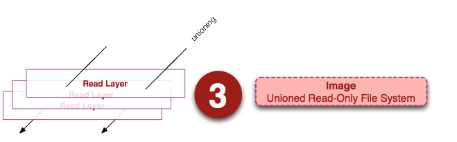
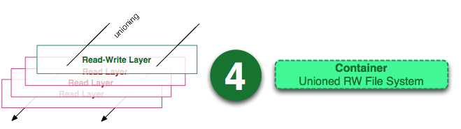
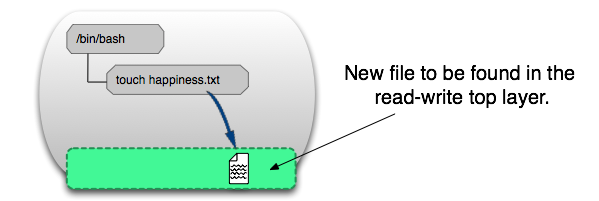

本文将讲解在docker中镜像和容器概念以及两者间的关系。

## docker镜像
docker的镜像概念类似虚拟机的镜像，可以看作是由多个镜像层叠加起来的文件系统。是一个只读的模板，基于base镜像可以创建新的容器，为指定的镜像添加一个可读写层，构成一个新的容器。

根据上图，镜像层的主要组成部分是镜像层ID、镜像层指针(指向父层)、元数据(包含docker构建和运行的信息和父层的层次信息)。
每一层都包括了一直指向父层的指针。如果一个层没有这个指针，说明它处于最底层。

镜像是一堆只读层的统一视角，这些只读层重叠在一起，除了最下面一层，其他层都会有一个指针指向下一层。统一文件系统(Union File System)技术能够将不同的层整合成一个文件系统。在用户角度看，只存在一个文件系统。镜像每一层都是只读层。

## docker容器
docker容器是由docker镜像创建的运行实例，容器也是一堆层的统一视角，不过容器最上面那一层是可读写的。即
容器 = 镜像 + 可读写层

一个容器中的进程可以对文件进行创建、修改、删除，这些改变都作用于可读写层。

docker容器类似虚拟机，只不过相对于虚拟机，docker守护进程可以直接与主操作系统进行通信，为各个docker容器分配资源，并保证每个容器都可以相互隔离独立，由于docker容器无需臃肿的从操作系统，docker可以节省大量的磁盘空间和其他系统资源。
3. docker仓库
docker仓库就是用来存放镜像的位置，docker运作中使用的默认仓库是[docker hub公共仓库](https://registry.hub.docker.com/)，当用户创建了自己的镜像之后可以用push命令将它上传到共有或私有的仓库。这样下一次再需要使用该镜像时直接使用pull从仓库拉下来就可以了。

本文部分内容借鉴于：浪仙(https://www.cnblogs.com/LangXian/)